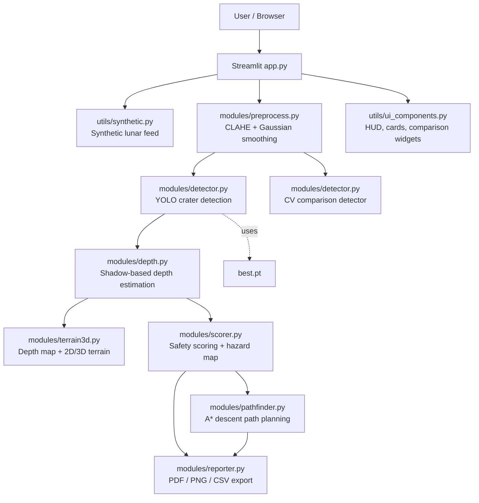

# Lunar Crater Detector + Depth Estimator

An interactive Streamlit mission console for crater detection, shadow-based depth estimation, terrain reconstruction, landing safety scoring, and clear-path planning. The app is synthetic-feed friendly, but it also accepts uploaded lunar imagery and runs the same downstream pipeline.

This project is not just a planetary landing-site analyzer. The core product is a crater detector plus depth estimator, with a derived safe descent path shown on top of the terrain and hazard maps.

## What It Does

- Loads a synthetic lunar scene by default, or a user-uploaded grayscale image.
- Enhances the image with CLAHE and Gaussian smoothing before detection.
- Runs trained YOLO crater detection from best.pt.
- Provides a CV comparison detector using Hough circles plus LoG blobs.
- Estimates crater depth from shadow projection geometry.
- Reconstructs a terrain depth map and renders 2D and 3D views.
- Scores landing safety using crater depth, crater diameter, and local crater density.
- Plans a clear descent route with A* over the derived safety map.
- Exports a mission report as PDF, PNG, and CSV.

## Architecture



## Pipeline Overview

1. Mission briefing and image source selection.
2. Raw image inspection and histogram telemetry.
3. Preprocessing controls for local contrast and smoothing.
4. Manual YOLO crater detection and optional CV comparison.
5. Photometric depth estimation from shadow length and sun geometry.
6. Terrain reconstruction with 2D heatmap, contour map, and 3D surface.
7. Landing safety scoring and hazard visualization.
8. A* descent path planning across the safety map.
9. Mission report export.

## How To Run

```powershell
python -m venv .venv
.venv\Scripts\Activate.ps1
pip install -r requirements.txt
streamlit run app.py
```

The app starts in synthetic-demo mode by default, so you can launch it immediately even without a data upload.

## Model Training

The repository includes a training script for the crater detector:

```powershell
python train_crater_yolo.py
```

The script expects the LU3M6TGT YOLO-format dataset inside the `LU3M6TGT_yolo_format` folder and trains a YOLO11s-based crater detector. The active app model path is:

- `best.pt`

If you retrain the model and want to use a new checkpoint, copy the new weights to the root directory as `best.pt` or update `modules/detector.py`.

## Controls That Matter

- Solar Incidence Angle controls the shadow-to-depth conversion.
- Solar Azimuth rotates the shadow projection axis used in depth diagnostics.
- Depth Safety Threshold changes the scoring penalty for deep craters.
- Landing Gear Span changes the diameter penalty used in scoring.
- Crater Density Radius changes the local clustering penalty.
- Pixel Scale converts pixels to meters for depth and path length.
- 3D Terrain Memory Profile changes the render mesh size and memory footprint.

## Repo Layout

- app.py: Streamlit entry point and mission workflow.
- modules/preprocess.py: CLAHE, Gaussian smoothing, histogram, and image stats.
- modules/detector.py: YOLO detection and CV comparison detection.
- modules/depth.py: Shadow masking, shadow projection, and crater depth estimation.
- modules/terrain3d.py: Depth map, heatmap, contour, and 3D surface rendering.
- modules/scorer.py: Safety scoring, hazard map generation, and safety gauge.
- modules/pathfinder.py: A* route planning and path overlays.
- modules/reporter.py: PDF, PNG, and CSV export helpers.
- utils/synthetic.py: Synthetic lunar scene generation.
- utils/ui_components.py: HUD, cards, comparison widget, and visual styling.


## Implementation Notes

- Depth, terrain, scoring, and path planning all depend on YOLO detections being available first.
- The CV detector is for comparison only and does not drive the downstream pipeline.
- Synthetic scenes include crater metadata so demos can be deterministic.
- Large images can be resized for stability, and Streamlit upload limits are configured in .streamlit/config.toml.

## Output Artifacts

- PDF mission report from the final step.
- PNG hazard map export.
- CSV crater summary export.

## Requirements

```text
streamlit
numpy
pandas
opencv-python-headless
plotly
scipy
scikit-image
ultralytics
reportlab
streamlit-image-comparison
Pillow
```
